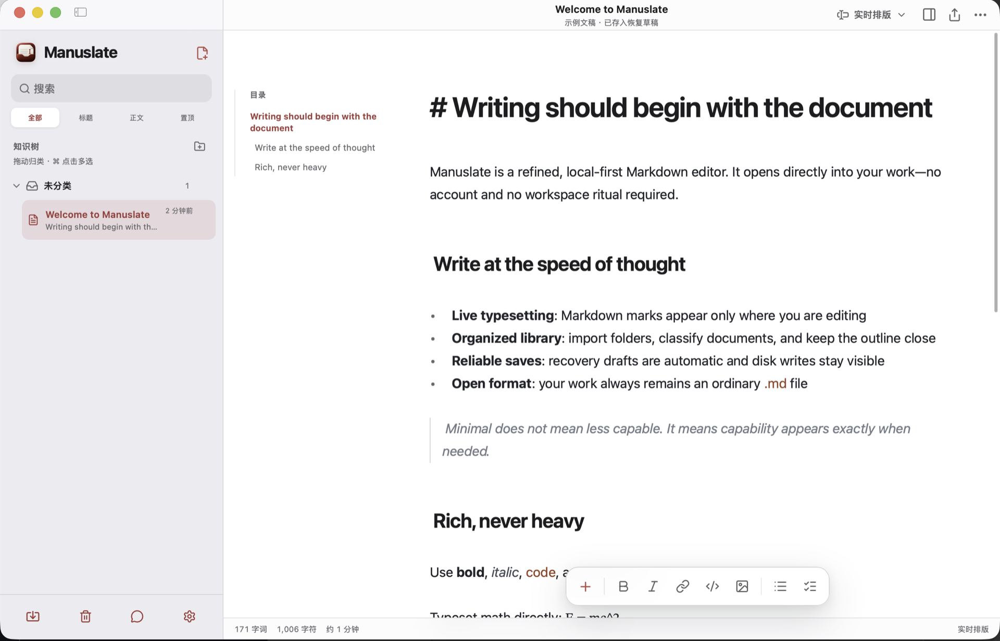

# Manuslate

[简体中文](README.zh-CN.md) · [Website](https://yyyz1011.github.io/manuslate/) · [Issues](https://github.com/yyyz1011/manuslate/issues)

<p align="center">
  
</p>

<p align="center"><strong>A refined, open-source, local-first Markdown editor and document library for desktop.</strong></p>

Manuslate opens directly into the document. It combines live Markdown writing, a structured library for local files, and visible save behavior without requiring an account or introducing a proprietary document format.



## Why Manuslate

- **The document is the home screen.** Open the app and begin reading or writing without passing through a dashboard.
- **Markdown stays portable.** Manuslate works with ordinary `.md` files and keeps relative paths intact when folders are imported.
- **Local state stays visible.** Recovery drafts, file permissions, disk writes, outside changes, and conflicts have explicit states.

The name combines **manuscript** and **slate**: a calm surface for turning structured text into finished work.

## Current capabilities

### Writing and reading

- Live typesetting, source, reading, and split views
- GFM, task lists, tables, footnotes, KaTeX math, links, images, and fenced code
- In-document outline, find and replace, command palette, focus mode, and word count
- Configurable document size, source size, line height, typeface, and page width

### Local library

- File and folder import with preserved relative paths
- Nested categories, pinned documents, and drag-to-organize
- A visible selection mode (or ⌘/Ctrl-click) with recoverable batch removal for documents, imported folders, and categories
- Ungrouped documents stay at the library root until groups exist; deleting the last document leaves a real empty library
- Scoped library search, backlinks, and broken-link checks
- User-selected default folder for new documents

### File trust and recovery

- Recovery drafts and explicit save state
- External-change detection with conflict comparison
- Automatic versions, named checkpoints, and local Recently Deleted
- Markdown, rich-text, standalone HTML, and system print/PDF output

### Interface

- Light, dark, and system appearance
- English and Simplified Chinese; English is the default on a new installation
- Keyboard-first desktop interaction and native macOS packaging through Tauri

## Download

Download the current Apple silicon preview from [GitHub Releases](https://github.com/yyyz1011/manuslate/releases/latest).

Manuslate is early-stage software. Back up important work and report unexpected behavior through [GitHub Issues](https://github.com/yyyz1011/manuslate/issues).

## Run the web build locally

```bash
npm install
npm run dev
```

Open <http://127.0.0.1:4173/>.

## Build the desktop app

Requirements:

- Node.js 20 or newer
- Rust stable
- The [Tauri v2 prerequisites](https://v2.tauri.app/start/prerequisites/) for your platform

```bash
npm install

# Native development window
npm run app:dev

# macOS .app
npm run app:build

# Distributable macOS .dmg
npm run app:dmg
```

Native artifacts are written to `src-tauri/target/release/bundle/`.

## Privacy and storage

Manuslate has no required account and no cloud dependency. The desktop app reads or writes only files and folders selected by the user. Recovery metadata, preferences, document organization, and remembered folder access remain on the current device.

Some browser capabilities depend on File System Access API support. The native app provides the intended desktop file workflow.

## Project status

Version `0.1.0` is an early desktop preview. The current packaged download targets Apple silicon Macs. The core milestone focuses on excellent Markdown editing and local document management; AI, cloud sync, mobile clients, and multiplayer collaboration are not part of this release.

## Contributing

Bug reports and focused feature proposals are welcome in [Issues](https://github.com/yyyz1011/manuslate/issues). Please include the operating system, Manuslate version, reproduction steps, and whether the document was a recovery draft or a local file.

## License

[MIT](LICENSE)
