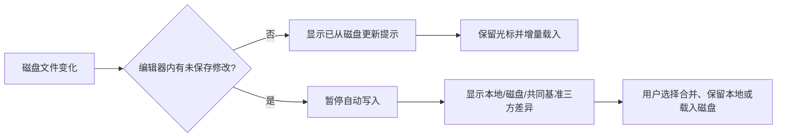
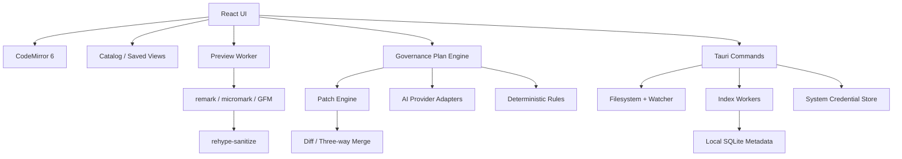

# PatchMark 产品设计 v0.3

更新日期：2026-09-11

## 1. 产品结论

PatchMark 是一款 **面向 Markdown 资料库管理者、文件优先、变更可审阅** 的开源桌面工作台。

它解决的不是“怎样调用 AI 写一段文字”，而是下面这个更具体的问题：

> 当一个目录积累了几十、几百甚至上万个 Markdown 文件时，怎样快速知道里面有什么、哪些内容重复或失效、该如何分类，并在不破坏原文件的前提下持续治理？

### 一句话定位

把任意 Markdown 文件夹变成可盘点、可分类、可治理、可持续维护的本地资料库，同时保留专业编辑器体验。

### 核心差异

1. Markdown 字符串而不是富文本 AST 或私有数据库是唯一真源。
2. 首屏是资料库总览：先盘点，再搜索、分类和治理。
3. 分类可以先成为虚拟视图，不强迫用户移动文件或改写 Frontmatter。
4. AI 永远提交变更计划和 patch，不直接批量整理文件。
5. 每次移动、重命名、写入元数据和合并都能预览影响并整体回滚。
6. 外部变化永远可见，不静默覆盖本地编辑。
7. 阅读、强编辑、链接、资产和资料库治理在同一条工作流内完成。
8. AI 结论必须带来源，AI/人工/规则/外部工具的修改具有可审计血缘。
9. CLI、插件和 Agent 不能绕过变更计划与权限边界。

### 第二轮竞品校正

Obsidian Bases 和 Front Matter CMS 已覆盖数据库式视图、属性、分类法、媒体和部分 AI 字段建议。因此，文件表格、Frontmatter 表单和 AI 标签不再被视为核心差异，只是必备能力。

PatchMark 的竞争壁垒收紧为四项：

- **Takeover**：无需预先配置 schema，接管任意历史 Markdown 文件夹。
- **Steward**：AI 推导并版本化分类体系，持续处理增量 Inbox。
- **Governor**：确定性检查与语义问题进入同一治理队列。
- **Transaction**：多文件操作有影响分析、审阅、复查、审计和回滚。

完整版能力与分阶段门槛见 [北极星产品蓝图](NORTH_STAR_BLUEPRINT.md)。

## 2. 目标用户

### 第一目标用户

维护 100–10,000 个 Markdown 文件的资料库管理者，包括技术文档维护者、独立开发者、研究资料整理者和内容仓库负责人。

典型文件包括：

- 多个项目的 README、CHANGELOG、规范和开发文档
- 产品 PRD、调研资料、会议记录和决策记录
- 博客、课程、知识库和静态网站文章
- AI agent 生成的报告、prompt、skill 和运行记录

### 第二目标用户

需要迁移或接管既有 Markdown 文件夹，并希望用可视化方式维护元数据、链接、状态和发布质量的创作者。

### 暂不服务

- 主要需求是多人实时协作、在线文档和复杂权限审批的企业
- 只在手机上编辑的用户
- 希望 AI 无人审阅地自动移动、覆盖或发布内容的用户

## 3. 用户要完成的任务

### JTBD 1：接管一个现有 Markdown 文件夹

当我导入或打开一个文件夹时，我希望马上看到文件数量、主题、格式、元数据、链接和资源健康度，而不是逐个打开文件理解它。

### JTBD 2：建立并维护分类体系

当资料越来越多时，我希望 AI 根据现有内容提出分类、标签和生命周期状态，并允许我批量审阅、修正和应用，而不是把控制权交给黑箱。

### JTBD 3：批量治理资料库

当出现重复、过期、孤立、命名混乱、元数据缺失或链接失效时，我希望得到按风险排序的待办清单，并一次修复一组问题。

### JTBD 4：专业地阅读和编辑

当我打开任意 Markdown 时，我仍需要高质量源码编辑、预览、大纲、表格、公式、图表、链接和搜索，而不是为了管理能力牺牲编辑体验。

### JTBD 5：安全地与外部工具共存

当 Codex、Git、脚本或其他编辑器修改当前文件时，我希望立刻知道，并选择载入、比较或合并，而不是被静默覆盖。

### JTBD 6：确认发布效果

当我准备发布 Markdown 时，我希望提前看到 GitHub、标准 GFM 或指定内容平台的兼容问题，并修复图片、链接和格式差异。

### JTBD 7：管理文档资产

当一个 Markdown 文件夹积累很多图片和链接时，我希望快速找到失效引用、孤立文件、重复图片和不稳定的绝对路径。

## 4. 产品原则

### 4.1 管理优先

- 打开工作区默认进入资料库总览，而不是空白聊天框。
- 任何 AI 分析都应落到可筛选的问题、集合、字段或变更计划。
- 先回答“有什么、哪里有问题、影响哪些文件”，再提供操作。
- 同一动作既支持单文件，也支持筛选结果和整个集合的批量处理。

### 4.2 原文可信

- 仅打开文件不能改变任何字节。
- 预览不能触发重新序列化。
- 格式化必须是用户主动执行的独立操作。
- 所有保存都可以查看 diff。

### 4.3 分类不等于改文件

- AI 分类结果默认保存在本地索引中，形成虚拟集合。
- 用户可以选择把确认结果写入 YAML Frontmatter、标签或目录结构。
- 写入 Frontmatter 时只修改相关字段，不重新序列化整篇文档。
- 移动和重命名之前必须计算链接、图片和引用的影响范围。

### 4.4 AI 可见、可控、可撤销

- AI 只产生建议或 patch。
- 用户可以逐块接受或拒绝。
- 每个 patch 或批量计划记录规则/提示词摘要、模型、时间和基准版本 hash。
- 文档已变化时，旧 patch 必须重新定位或提示冲突。
- 批量任务必须支持暂停、失败续跑和整体回滚。

### 4.5 先确定性检查，再调用 AI

- 文件计数、hash、Markdown 语法、链接、资源、Frontmatter schema 由本地代码检查。
- AI 用于主题理解、模糊重复、矛盾、过期迹象和分类建议。
- 无模型时，资料库总览、搜索、规则检查和手动治理仍然完整可用。

### 4.6 本地优先、开放免费

- 不登录也能完成全部基础编辑。
- 内容默认不上传，调用云模型前明确显示发送范围。
- API Key 优先存储在系统安全凭据中。
- 索引、历史记录和附件信息保存在本地。
- 编辑器、本地管理能力和模型适配器永久免费开源。
- 用户可自带云模型接入点，也可使用 Ollama、LM Studio 等本地模型。

### 4.7 安静的 AI

- AI 不用悬浮气泡持续打扰用户。
- 选中文字后才出现轻量操作入口。
- 长任务进入右侧任务栏，完成后给出最终结果和异常。
- 不重复展示“正在思考”式过程卡片。

### 4.8 来源与能力边界

- AI 分类、矛盾、重复和过期判断必须引用文件、内容片段和基准 hash。
- 置信度只决定排队顺序，不代表事实正确。
- AI、人工、规则和外部程序的修改分别记录来源。
- Agent 默认只读；任何写入只允许创建等待批准的 Governance Plan。
- 插件必须声明文件范围、网络、密钥、命令执行和写入权限。

## 5. 核心用户流程

### 5.1 首次打开

1. 用户选择一个本地文件夹或单个 Markdown 文件。
2. 应用只读扫描并建立可删除的本地索引，不复制或改写正文。
3. 总览展示文件、目录、字数、格式、Frontmatter、标签、链接、资源和确定性问题。
4. 用户可先按类型、状态、时间、目录和健康问题筛选资料。
5. 未配置 AI 时，盘点、搜索、规则检查、编辑与预览仍完整可用。
6. 用户首次运行语义分类时再选择云模型接入点或本地模型。

### 5.2 AI 建议分类体系

1. 用户选择全库、某个目录或当前筛选结果。
2. 应用先抽取标题、路径、标题层级、现有 Frontmatter、标签和有限正文摘要。
3. AI 提出分类树、字段 schema、标签合并方案和无法判断的文件。
4. 用户可以重命名、合并、删除类别，并给出正反例。
5. 系统生成逐文件分类结果及置信度，低置信度进入人工队列。
6. 确认结果先成为虚拟集合；用户再决定是否写入 Frontmatter 或移动目录。

### 5.3 批量治理


批量操作包括：补齐元数据、规范标签、重命名、移动、合并重复文档、归档过期内容和修复引用。任何一步出现冲突时只停止相关文件，不让其余失败状态变得不可解释。

### 5.4 资料库健康巡检

1. 确定性引擎检查坏链、孤立文档、孤立资源、重复文件、Frontmatter 异常和命名问题。
2. AI 可选检查近似重复、主题错放、内容矛盾、过期迹象和缺少摘要。
3. 问题按“数据风险、导航问题、内容质量、建议优化”分级。
4. 管理者从问题队列进入文件集合，批量处理后重新验证。
5. 历史趋势只显示真实检查结果，不制造模糊的单一健康分。

### 5.5 局部 AI 修改

1. 用户选择一段文字。
2. 使用快捷动作：精简、润色、改写、翻译、解释、自定义要求。
3. AI 返回最小 patch，而不是完整文档。
4. 编辑区内联显示删除和新增内容。
5. 用户逐块接受、拒绝或继续追问。
6. 接受后进入正常撤销栈，尚未自动保存。

### 5.6 整篇文档审查

1. 用户运行“检查这篇文档”。
2. AI 先返回结构化问题清单，不直接修改。
3. 问题按事实、结构、表达、格式、链接分类。
4. 用户选择某个问题，再生成对应 patch。
5. 每个建议显示引用的原文位置和影响范围。

### 5.7 外部文件变化



### 5.8 发布前检查

1. 用户选择目标：CommonMark、GitHub GFM 或自定义规则集。
2. 应用检查不兼容语法、危险 HTML、失效资源和路径。
3. 预览区切换目标渲染效果。
4. 修复操作仍以 patch 展示。
5. 首版只提供复制或导出，不直接发布。

## 6. 信息架构

### 主界面

```text
┌──────────────┬─────────────────────────────────┬──────────────────┐
│ 工作区导航   │ 总览 / 列表 / 编辑器            │ 检查器 / AI / Diff│
│              │                                 │                  │
│ 文件树       │ 资料库指标与问题队列            │ 筛选与字段        │
│ 智能集合     │ 可排序、分组、批量选择的文档表  │ 当前文档大纲      │
│ 分类与标签   │ Markdown 原文 / 阅读预览         │ 变更计划与审计    │
│ 健康检查     │ 内联建议和外部变化提示          │                  │
└──────────────┴─────────────────────────────────┴──────────────────┘
│ 状态栏：文件数 · 索引状态 · 选中数 · 方言 · 磁盘状态 · 模型状态 │
└──────────────────────────────────────────────────────────────────┘
```

五个默认一级工作区：

- **总览**：规模、分类覆盖、字段完整度、链接与资源问题、最近变化。
- **Inbox**：新文件、低置信度分类、冲突、规则失败和待复查内容。
- **资料**：表格/列表、筛选、分组、排序、批量操作和智能集合。
- **文档**：源码编辑、阅读预览、大纲、反向链接和单篇检查。
- **治理**：问题队列、AI 分类任务、变更计划、执行记录和回滚。

分类、上下文、发布和自动化属于高级工作区，启用相关功能后才进入主导航，避免强大变成拥挤。

预览不是永久占据一半屏幕。文档区提供三种布局：

- 纯编辑
- 编辑＋预览
- 纯阅读

### 命令入口

- `Cmd/Ctrl + K`：产品命令和 AI 动作统一入口
- 选择文本后的轻量浮动条
- 右侧 AI 任务面板
- 文档列表顶部的批量操作条
- 文件变化和冲突使用顶部状态条，不使用模态弹窗打断输入

## 7. 功能规划

### 产品完整版：强 Markdown 基座

- 多工作区、本地文件树、标签页、最近文件和快速打开
- CodeMirror 源码编辑、多光标、正则查找替换、折叠、片段和命令面板
- CommonMark/GFM 预览，扩展支持脚注、YAML Frontmatter、数学公式、Mermaid、警告块
- 表格可视化辅助编辑，但最终仍写标准 Markdown 表格
- 阅读模式、大纲、同步滚动、反向链接、链接补全、文档内跳转
- Frontmatter 表单与源码双视图，重复字段或非法 YAML 不静默修复
- 拼写检查、字数/阅读时长、专注模式、主题和自定义 CSS
- HTML/PDF 导出；Pandoc 存在时扩展 DOCX、EPUB 等格式
- 文件监听和外部变化提示
- 保存前 diff
- 本地快照和崩溃恢复
- 图片粘贴到可配置资源目录
- 图片、附件和相对路径管理
- 危险 HTML 消毒

### 产品完整版：资料库管理

- 全库只读盘点与增量索引
- 文件名、全文、Frontmatter、标签、链接、正则组合搜索
- 文档表格视图、分组、排序、筛选、批量选择和保存视图
- 文件夹、标签、Frontmatter、链接关系和虚拟集合并存
- 分类覆盖率、字段完整度、格式分布、最近变化和问题趋势
- 坏链、孤立文档、孤立资源、重复文件、命名和 schema 检查
- 文件重命名和移动时自动更新受影响引用
- 批量补字段、改标签、移动、重命名、归档、导出
- 每次批量操作先 dry-run，完成后可验证和整体回滚
- 新增、外部修改、低置信度和待复查项目进入统一增量 Inbox
- 分类体系与 schema 版本化，可比较覆盖率、冲突和迁移影响

### 产品完整版：AI 资料管理员

- 对新导入文件生成摘要、文档类型、主题、标签、状态和归属建议
- 从现有资料反推分类树与 Frontmatter schema
- 合并同义标签，找出分类错误和低置信度结果
- 发现近似重复、内容矛盾、过期迹象和可合并文档
- 生成资料库目录、索引页、主题综述和缺口报告
- 用自然语言创建筛选条件和智能集合
- 给出跨文件治理计划，确认后逐文件生成 patch
- 每个结论引用来源文件和行号；无法判断时进入人工队列
- 支持增量处理，只重新分析新增或内容 hash 变化的文件
- 用户可维护分类 Golden Set，模型或提示变化先做可量化回归
- AI/人工/规则/外部工具的内容来源进入审计记录

### P0：首个可体验版本

- 打开普通 Markdown 文件夹并完成零改写盘点
- 总览、文件表格、文件树、全文搜索和组合筛选
- CommonMark/GFM 源码编辑、阅读预览、大纲、标签页和保存前 diff
- Frontmatter 读取、schema 检查和单字段最小修改
- 坏链、孤立文档、缺失资源、精确重复和命名问题检查
- 创建虚拟集合，结果只存在可删除的本地索引
- AI 生成分类树并为所选文件批量分类
- 分类结果逐组审阅；可选写入 Frontmatter
- 批量操作 dry-run、执行审计和回滚点
- 外部文件变化检测与冲突保护
- OpenAI Responses、OpenAI Chat Completions、Anthropic Messages 适配器
- 自定义 OpenAI-compatible 接入点，Ollama/LM Studio 本地连接
- API Key 使用系统安全凭据，模型配置与文档内容分离

### P1：增强管理与编辑

- 反向链接、WikiLink 兼容、重命名引用更新和关系图
- 近似重复、矛盾、过期迹象、标签合并和归档建议
- 表格辅助编辑、脚注、公式、Mermaid、警告块和 Frontmatter 表单
- 文本规则插件，支持 textlint 类规则、规则包和 dry-run 修复
- 资源 hash 去重、尺寸/格式检查和相对路径修复
- AI 局部润色、翻译、总结与整篇审查，仍以 patch 应用
- GitHub 渲染预览
- Pandoc 导出配置
- Git 状态、提交历史和变更集合视图
- 可选 embedding 语义检索；缺失 embedding 能力时退回全文索引
- 可检查的 Context Recipe：文件清单、去重、来源 hash、token 和费用估算
- AI 内容血缘、未审阅标记和按模型/任务过滤的审计视图

### P2：扩展能力

- 自定义 Markdown 方言
- 可审查的自动化任务
- 规则与只读数据源插件 API
- 发布适配器
- 多仓库组合看板
- 可选官方托管模型服务，但不影响 BYOK/BYOM 和开源核心
- 默认只读 CLI/MCP；写操作只能创建待审批治理计划
- GitHub、VitePress、MkDocs、Hugo、Hexo 和 Quartz 发布配置档

## 8. AI 能力边界

### 适合 AI

- 文档类型、主题、标签和状态建议
- 分类树与元数据 schema 草案
- 跨文档主题聚类和内容缺口识别
- 近似重复、矛盾和过期迹象发现
- 资料库目录、索引页和主题综述候选稿
- 语义改写、总结、翻译等辅助编辑

### 应使用确定性代码

- Markdown 解析与渲染
- diff、patch 和三方合并
- 文件 hash、索引增量判断和精确重复检测
- 链接与文件存在性检查
- 图片 hash、去重和路径修改
- Frontmatter schema、格式和命名规则检查
- 保存、版本和冲突处理

AI 不能承担数据完整性职责，也不能把“模型置信度”包装成事实。所有 AI 结论都必须标记来源范围、模型和时间。

### AI 输入最小化

- 分类优先发送标题、路径、现有元数据、标题层级和有限摘要，不默认发送整库全文。
- 用户可查看本次将发送的文件数、字段和估算文本量。
- 敏感目录和 glob 可永久排除；日志不保存正文。
- 批量任务按文件 hash 缓存结果，不对未变化内容重复计费。

### 模型能力降级

- 不假设所有 OpenAI-compatible 服务都支持模型列表、严格 JSON、工具调用或 embedding。
- 分类基础协议只要求普通文本生成；结构化结果必须本地校验。
- 模型 ID 可手填；连接测试分别验证鉴权、模型、流式输出和结果解析。
- embedding 不可用时，全文搜索、规则检查和人工分类不受影响。

## 9. 文件与数据模型

### 文档

```ts
type OpenDocument = {
  path: string
  diskHash: string
  baseText: string
  editorText: string
  encoding: string
  lineEnding: 'LF' | 'CRLF'
  dirty: boolean
}
```

### AI Patch

```ts
type AIPatch = {
  id: string
  documentPath: string
  baseHash: string
  ranges: PatchRange[]
  promptSummary: string
  provider: string
  model: string
  createdAt: string
  status: 'pending' | 'partial' | 'accepted' | 'rejected' | 'conflicted'
}
```

### 资料库索引与治理计划

```ts
type IndexedDocument = {
  path: string
  contentHash: string
  title?: string
  frontmatter: Record<string, unknown>
  headings: string[]
  tags: string[]
  outboundLinks: string[]
  virtualCollectionIds: string[]
  indexedAt: string
}

type GovernancePlan = {
  id: string
  scope: string[]
  baseHashes: Record<string, string>
  operations: Array<
    | { type: 'patch'; path: string; patchId: string }
    | { type: 'move'; from: string; to: string }
    | { type: 'rename'; from: string; to: string }
    | { type: 'archive'; path: string; destination: string }
  >
  source: 'rule' | 'ai' | 'manual'
  status: 'draft' | 'approved' | 'running' | 'partial' | 'done' | 'rolled_back'
}
```

SQLite 只保存索引、虚拟集合、设置、任务、审计和快照元数据；正文仍保存在用户的 Markdown 文件中。删除本地索引后，原资料库应保持可用且不丢信息。

## 10. 技术架构建议



模型请求由 Tauri 后端发出，避免渲染层持有密钥并绕开浏览器 CORS。首版供应商层使用统一的内部接口，但分别实现 OpenAI Responses、OpenAI Chat Completions、Anthropic Messages 和通用 OpenAI-compatible 协议，不把“兼容”误认为能力完全相同。

### 为什么首版不使用 ProseMirror 做完整 WYSIWYG

ProseMirror 很适合结构化富文本，但它要求在 Markdown 字符串与文档模型之间反复转换。对于“原文不被重排”这一核心承诺，第一版采用 CodeMirror 的字符串编辑模型风险更低。

未来如果增加可视化编辑，应满足：

- 未触及的源码片段按字节保留。
- 只对被编辑节点进行局部序列化。
- 每次可视化操作都有 round-trip golden test。

## 11. 开源与可持续性

已确定应用和本地功能永久免费开源，用户自带模型接入点。不开设本地“Pro 功能锁”，不要求账号才能管理自己的文件。

### 可选的长期收入

- GitHub Sponsors、Open Collective 或一次性赞助
- 可选官方托管 AI 额度，为不懂 API 的用户降低门槛
- 可选团队部署、支持或定制服务，但不削弱开源桌面版
- 品牌合作或企业赞助必须与编辑器内的内容和模型选择隔离

许可证尚未拍板。当前倾向 Apache-2.0，以便广泛采用并提供明确专利授权；如果更重视阻止闭源托管分支，再评估 AGPL-3.0。

### 不优先

- 按座席销售给企业
- 依赖人工交付的写作服务
- 通过订阅锁住本地编辑、索引、分类或导出
- 以“无限 AI 写作”为卖点的高推理成本套餐

## 12. 主要风险

| 风险 | 影响 | 应对 |
|---|---|---|
| 用户觉得 VS Code＋脚本已经够用 | 产品没有独立价值 | 验证总览、AI 分类、批量治理和回滚能否显著减少维护时间 |
| 与 Obsidian Bases / Front Matter CMS 差异不明显 | 沦为功能较少的替代品 | 把 schema 推导、分类版本、统一治理队列、事务回滚和 AI 血缘做成端到端主流程 |
| 功能丰富变成功能堆砌 | 首版无法完成、体验混乱 | 用“盘点→分类→治理→验证”作为主流程，其他能力按其是否服务该流程排序 |
| AI 分类不稳定 | 管理者不敢批量应用 | 虚拟集合优先、置信度分层、正反例、低置信度人工队列、dry-run 与回滚 |
| 批量改写 Frontmatter 污染 diff | 破坏原文可信承诺 | 最小字段 patch、保留未触及字节、异常 YAML 停止并提示 |
| Markdown 方言过多 | 兼容测试无限膨胀 | 首版只承诺 CommonMark＋GFM，其他采用配置档 |
| AI patch 定位失败 | 用户不信任产品 | 基准 hash、上下文锚点、最小 patch、冲突即停止 |
| 大文件预览卡顿 | 输入体验变差 | Worker、增量刷新、预览节流、文件大小保护 |
| 云模型泄露内容 | 隐私风险 | 最小字段/摘要、请求预览、排除目录、BYOK、明确供应商 |
| 功能膨胀成专有知识库 | 失去差异化 | 内容永远是普通文件，数据库只做可删除索引和虚拟视图 |
| BYOK 对普通用户门槛高 | 转化率受限 | 供应商预设、本地模型自动发现、连接测试；未来提供可选托管服务 |
| Agent/插件绕过审阅 | 文件被后台修改或泄露 | 默认只读、能力声明、目录范围、写操作只生成待审批计划 |

## 13. 开发前验证

在进入完整开发前，先做一个可交互原型，只验证四个动作：

1. 打开一个混乱的 Markdown 文件夹，3 分钟内理解其规模和主要问题。
2. 让 AI 建议分类体系，并把结果作为虚拟集合审阅。
3. 选择一组文件补齐元数据，预览批量 diff 后应用并回滚。
4. 模拟外部文件变化，确认索引增量更新且未覆盖本地编辑。

找 8–12 位真实维护 100 个以上 Markdown 文件的用户完成任务，记录：

- 他们现在怎样盘点、分类、重命名和归档。
- 导入后多久能找到一个指定主题及所有相关文件。
- 是否理解并信任虚拟集合、置信度和批量变更预览。
- 哪类治理建议会被接受，哪类必须逐文件检查。
- 一周后是否再次打开工作区处理新增资料。

如果用户只想要单篇润色或通用聊天，应停止扩大 AI 写作功能；如果用户看懂总览却不愿应用任何分类或治理操作，应把首版进一步收窄为“Markdown 资料库体检与批量元数据工具”。

## 14. 当前决策

已经决定：

- 编辑器和全部本地功能永久免费开源。
- 用户自带云模型接入点，或连接本地模型。
- 产品主视角是资料库管理者，AI 重点管理已有 Markdown。
- 先桌面端，后续再考虑 Web。
- 先源码可信，后续再考虑 WYSIWYG。
- 先本地文件，后续再考虑云同步。
- AI 先生成分类、治理建议和 patch，不直接保存、移动或重命名。
- 第一版兼容 CommonMark 和 GFM。
- 文件表格、Frontmatter 表单和 AI 标签属于基础能力，不再作为独立差异化卖点。
- 核心差异聚焦 Takeover、Steward、Governor 和 Transaction 四个闭环。
- AI 结论必须带来源，Agent 写操作必须进入待审批治理计划。

尚未决定：

- 正式产品名
- Apache-2.0 或 AGPL-3.0 许可证
- 首批种子用户选技术文档维护者还是研究资料管理者
- 是否首版包含 Git 操作
- Windows 和 macOS 哪个平台先发布
